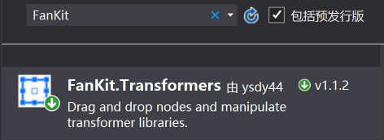

# FanKit.Transformers

拖放节点，并操作变换的类库。


## 开发环境

|Key|Value|
|:-|:-|
|系统要求| Windows10 Creators Update 或更高|
|开发工具|Visual Studio 2017|
|编程语言|C#|
|显示语言|English|
|评论语言|中文|

  


在 Nuget 里搜索 'FanKit.Transformers
' 并下载。
  


### 示例

运行 "TestApp".

```xaml
    xmlns:transformers="using:FanKit.Transformers"
    xmlns:canvas="using:Microsoft.Graphics.Canvas.UI.Xaml"

    <Page.Resources>
        <transformers:CanvasOperator x:Name="CanvasOperator" DestinationControl="{x:Bind CanvasControl}" Single_Start="CanvasOperator_Single_Start" Single_Delta="CanvasOperator_Single_Delta" Single_Complete="CanvasOperator_Single_Complete"/>
    </Page.Resources>

   <canvas:CanvasControl x:Name="CanvasControl" Draw="CanvasControl_Draw" CreateResources="CanvasControl_CreateResources"/>   
"
```
and

```csharp
using FanKit.Transformers;
using Microsoft.Graphics.Canvas;
using System.Numerics;
...
    //Controller
    Transformer transformer = Transformer.Controller(this.TransformerMode, startingPoint, point, this.Layer.TransformerMatrix.OldDestination, isRatio, isCenter);

    this.Layer.TransformerMatrix.Destination = transformer;
...
```


## 了解更多

您可以从 Windows 10 商店中的演示应用程序中了解更多信息:<br/>
[FanKit](https://www.microsoft.com/store/productId/9PD2JJZQF524)


1.点击顶部栏中的“Transformers” 项。


2.寻找简易示例。


玩的开心...
